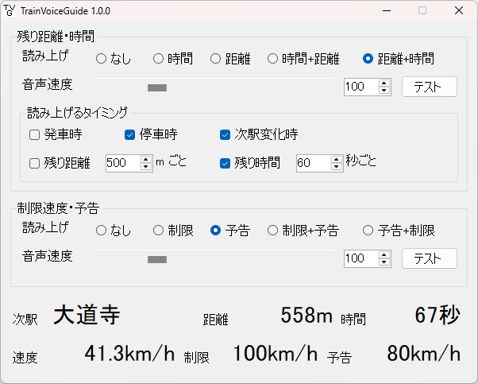

TrainVoiceGuide
===============

[TRAIN CREW](https://acty-soft.com/traincrew/) 向けの外部ツールです。  
UIの代替として、停車/通過までの残り時間と距離、および制限速度とその予告の情報を音声でお知らせします。

特に、UIを表示したくても表示できないVRモードでの使用がオススメ！

現在、日本語のみの対応です。  
Only Japanese voice and text are available in this version.

## 使用している音声合成ライブラリについて

本ツールでは、アクエスト社の音声合成ライブラリ AquesTalk を使用しています。

本ツールで使用しているバージョンは、(「個人利用」でない場合を含め) 使用にあたりライセンスの購入は不要ですが、Windows プラットフォーム上でのみ使用が許諾されています。
